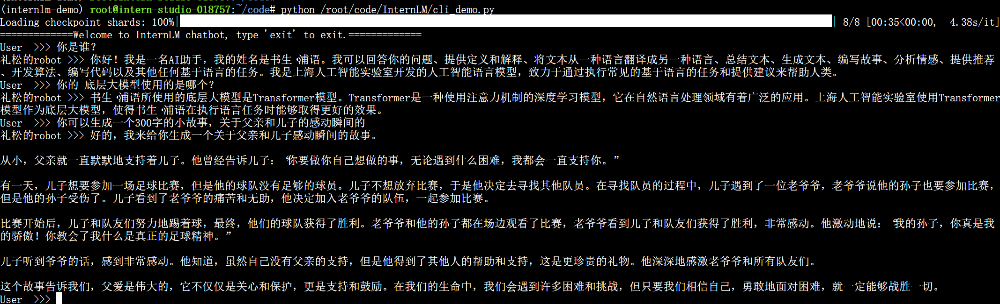
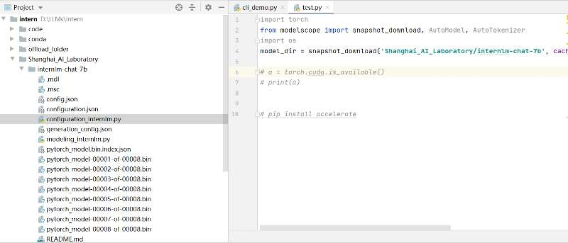

1. InternLM-Chat-7B 智能对话 Demo
  1.1 总的一个理解就是，它是一个基于已经预训练好的模型，具有不错对话上下文理解能力的大语言模型，并不具备增强或者继续学习的能力。
  1.2 希望不单单是在开发机上面搭建起来环境和服务，也希望后续有时间后在自己的本地电脑上面搭建起一个服务，不过可能最后还是需要类似于开发机的GPU能力
  1.3 在本地使用pycharm的ssh功能，远程到开发机的时候需要注意：使用tools-start_ssh_session就可以在本地的terminal里进到远程机的环境，运行代码

2. Lagent 智能体工具调用 Demo
  2.1 这个demo体现和展示了智能体的多扩展和集成能力，比如里面用到的Google搜索能力，Python解释器计算能力等

3. 浦语·灵笔图文理解创作 Demo
  3.1 一个完全不一样的模型，支持文字图像识别的强大模型，适应于和丰富了很多用户使用的场景

总结： 
  1. 全面了解internLM整个链条工具都有哪些能力，为后续的外挂知识库和微调打下基础
  2. 如何实现这么多能力集成到一个智能体里面，以及如何创建属于自己的定制化数据集，私人助理。可能需要更多更深入的实战
  3. 如何在有限的硬件资源下，实现自己想要的智能体并且部署

作业1.
    具体实现：
    

作业2.
  具体实现：
  
